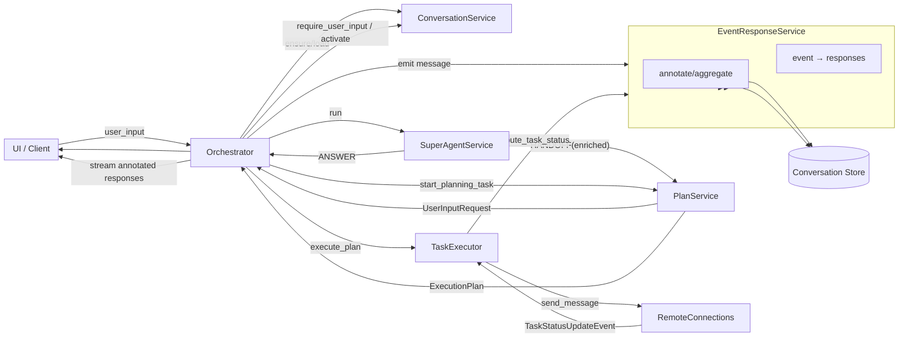
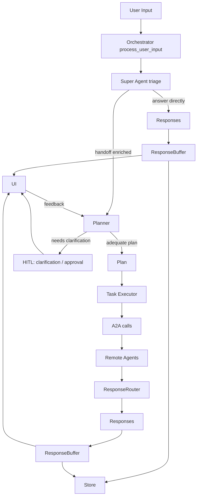
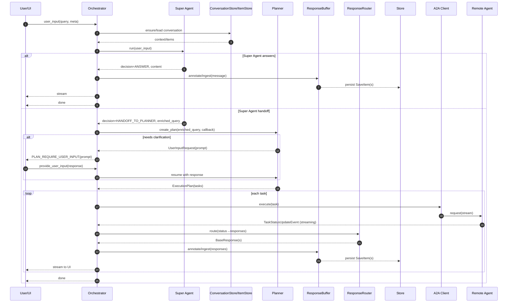

# ValueCell 核心架构

本文档解释 `valuecell/core/` 下的模块在运行时如何协作。

## 亮点

- Super Agent 在规划前进行分流：轻量级"Super Agent"首先分析用户输入，要么直接回答，要么将丰富的查询交给规划器。
- 异步、可重入的编排器：`process_user_input` 流式传输响应，现在在后台生产者中运行规划/执行，因此即使客户端断开连接，长时间运行的工作也会继续。
- 带 HITL 的规划器：在缺少信息/风险步骤时通过 `UserInputRequest` 暂停，在用户反馈后恢复以产生充分的计划。
- 流式管道：A2A 状态事件 → `ResponseRouter`（映射到 BaseResponse）→ `ResponseBuffer`（注释/聚合）→ 持久化到 Store 并流式传输到 UI，具有稳定的项目 ID 用于部分聚合。
- Agent2Agent (A2A) 集成：任务通过 `a2a-sdk` 调用远程代理；状态事件驱动路由；代理可以通过轻量级装饰器/服务器包装。
- 对话记忆：内存/SQLite 存储支持可重现的历史记录、快速的"从上次恢复"和可审计性。
- 健壮性：类型化错误、来自路由器的副作用（例如，失败任务），以及在适当的地方进行重试/退避策略的空间。

## 服务交互概述

下面的图表重点关注编排器如何与核心服务协作。它反映了 `coordinate/`、`super_agent/`、`plan/`、`task/`、`event/` 和 `conversation/` 下的当前代码结构。

要点：

- 编排器是中心：它调用 SuperAgentService、PlanService、TaskExecutor，并使用 ConversationService 管理状态。
- EventResponseService 执行两个角色：
  - 路由：通过 ResponseRouter 将远程任务状态事件映射到类型化的 BaseResponses。
  - 缓冲和持久化：通过 ResponseBuffer 使用稳定的项目 ID 进行注释，并写入对话存储。
- Super Agent 可以通过直接答案短路；否则它将丰富的查询交给规划器。

## 高级流程

编排循环接收用户输入，让 Super Agent 分流并可能回答或丰富请求，然后规划下一步（在需要时使用 HITL）并通过远程代理（A2A）执行任务。响应增量流回并路由到适当的接收器（UI、日志、存储）。

### 序列：异步和可重入性

## 编排器：process_user_input

编排器入口点（`coordinate/orchestrator.py::AgentOrchestrator.process_user_input`）接收用户消息（加上上下文 ID）并协调整个生命周期：

1. 委托给 Super Agent 以分流请求：直接回答简单查询或丰富查询并交给规划
2. 运行规划器以派生可执行的计划；如果计划需要确认或额外参数，触发人机交互循环（HITL）
3. 通过任务执行器执行计划
4. 在执行时流式传输部分响应
5. 持久化结果并发出最终响应

编排器是异步和可重入的，现在解耦了生产者/消费者：

- 所有 I/O 边界（`await`）都是显式的，以支持并发
- 后台生产者继续规划/执行，即使客户端断开连接；异步生成器只是排空每个调用的队列
- 如果需要人工确认，编排器可以暂停、显示检查点，并在反馈到达时稍后恢复
- 通过幂等响应缓冲和对话状态支持可重入性：恢复从最后确认的步骤继续

### 流式模型

响应在执行任务时增量产生：

- 远程代理状态事件首先由 `ResponseRouter` 映射到类型化的 `Response` 对象（消息块、推理、工具结果、组件）
- `ResponseBuffer` 使用稳定的项目 ID 进行注释和聚合部分，`EventResponseService` 将它们持久化到对话存储
- 编排器将注释的响应流式传输到 UI；持久化和流式传输与客户端连接解耦

这允许 UI 在长时间运行的步骤（例如远程代理调用）仍在进行时呈现部分进度。

## Super Agent：规划前分流

Super Agent 对用户输入执行快速、工具增强的分流，以决定是直接回答还是交给规划器。

职责：

- 检测可以立即回答的简单问答或检索式请求
- 可选地丰富/规范化查询并为规划提供简洁的重述
- 记录最少的理由以供审计

底层实现：

- `super_agent/core.py` 定义 `SuperAgent`、决策模式（`SuperAgentOutcome`）和工具连接
- `super_agent/prompts.py` 包含指令和预期输出模式
- `super_agent/service.py` 公开编排器使用的简单外观

如果决策是 ANSWER，编排器流式传输内容并返回。如果决策是 HANDOFF_TO_PLANNER，丰富的查询将传递给规划器。

## 规划器：意图 → 计划（带 HITL）

规划器将自然语言用户输入（通常由 Super Agent 丰富）转换为可执行的计划。其职责包括：

- 解释用户的目标和可用的代理能力
- 识别缺失的参数和歧义
- 产生描述步骤和工具/代理调用的类型化计划

人机交互循环集成到规划中：

- 当规划器检测到信息不足或风险操作时，它会发出"澄清/批准"检查点
- 编排器通过路由器将该检查点呈现给 UI/用户
- 一旦用户添加信息或批准步骤，编排器就会使用更新的计划上下文恢复

底层实现：

- `plan/planner.py` 封装决策逻辑（`ExecutionPlanner` 和 `UserInputRequest`）
- `plan/prompts.py` 集中提示模板（当使用基于 LLM 的规划时）
- `plan/models.py` 定义计划/步骤数据模型，由编排器和执行器使用
- `plan/service.py` 管理规划器生命周期和待处理的用户输入注册表

## 任务执行

规划后，任务执行器运行每个任务。任务是原子单元，通常调用远程代理来执行工作。支持计划任务，可以根据其计划重新运行；流式输出被累积并汇总为计划结果。

执行特征：

- 任务异步等待；独立任务在安全时可以并发运行
- 每个任务在运行时发出结构化响应（工具结果、日志、进度）
- 失败被转换为类型化错误，可以触发重试或补偿步骤（取决于策略）
- 当 Super Agent 交给特定子代理时，发出开始/结束组件以标记该子代理对话窗口

底层实现：

- `task/executor.py` 流式执行，集成计划任务累积，并通过响应服务路由 A2A 事件
- `task/service.py` 持久化和转换任务状态；`task/models.py` 定义任务的形状

对话和项目存储记录输入/输出以供重现和审计。

## A2A 集成：与远程代理通信

每个任务使用 Agent2Agent (A2A) 协议与远程代理交互：

- 请求/响应模式由代理能力"卡片"和消息模型定义
- 本地运行时使用 `a2a-sdk` 通过所选传输（HTTP 或其他）发送/接收
- 流式结果被输入到 `ResponseBuffer` 并实时路由到客户端

此协议边界使代理位置透明：它们可以在本地、远程运行，或在不需要更改编排器的情况下交换。

## 代理实现：装饰器和连接

远程代理可以使用核心代理装饰器和连接实用程序以非常小的占用空间嵌入：

- `agent/decorator.py` 将普通异步函数包装为完全类型化的代理处理程序
- `agent/connect.py` 将装饰的函数连接到运行时（注册、路由）
- `agent/card.py` 描述能力、输入和输出，以便规划器可以选择它

当它适合用户目标时，规划器可以选择此能力，编排器将通过 A2A 路由任务来执行它。

## 对话和记忆

`conversation_store.py` 和 `item_store.py` 抽象对话历史和每项存储：

- 内存和 SQLite 后端可用
- 过滤和分页支持高效的上下文检索
- 可以获取最新项目以快速"从上次恢复"行为

此记忆层支持可重入性和可审计性。

## 异步和可重入性详情

- 所有外部调用（super-agent 分流、规划、远程代理、存储）都被等待
- 后台生产者独立于客户端连接运行；消费者可以在不停止执行的情况下取消
- `ResponseBuffer` 支持部分输出的幂等聚合，因此恢复的会话可以安全地重放或继续
- 编排器检查点（HITL）被建模为显式产生点；恢复时，相同的上下文 ID 引导流程从下一步继续
- 执行上下文支持验证（用户一致性、TTL）和过期会话的清理
- 背压：当接收器较慢时，路由器可以应用流控制

## 错误处理和恢复能力

典型边缘情况和策略：

- 缺失参数 → HITL 澄清
- Super Agent 错误 → 作为结构化失败呈现；回退到规划器移交可以是策略定义的
- 规划器错误 → 带有面向用户指导的结构化失败
- 代理超时 → 重试/退避策略；部分结果保留在缓冲区中
- 传输错误 → 通过类型化异常呈现；编排可能重试或中止
- 无效或过期的执行上下文 → 安全取消并带有面向用户的消息
- 一致性 → 对话记录确保输入/输出是持久的

## 可扩展性

- 添加新代理：创建能力卡片，实现装饰的异步处理程序，注册/连接它
- 添加新存储：实现 `ItemStore`/`ConversationStore` 接口
- 添加新传输：集成兼容适配器并更新 A2A 客户端连接
- 自定义 Super Agent：调整提示/决策逻辑或工具；控制何时回答与移交
- 自定义规划：扩展规划器提示/逻辑并丰富计划模型

---

简而言之，编排器协调异步、可重入的分流 → 规划 → 执行 → 流式传输循环，在适当的地方有人工检查点。Super Agent 可以在规划前回答或丰富，任务通过 A2A 与远程代理通信，响应管道在维护持久、可重现状态的同时实时通知用户。
